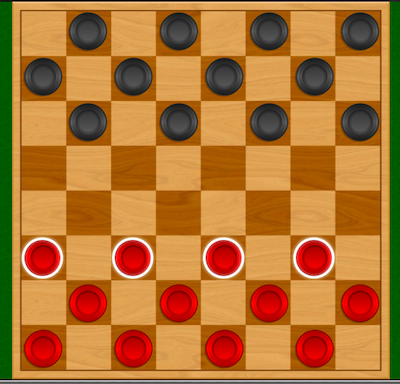

# Let's Play Checkers



## The `Game` Class

The `Game` class only offers a few methods for interacting with the game itself. The first three methods let you get information about the current game. Call the last method to inform the game about your move decision. 

```
    virtual size_t             countAvailablePieces(PieceColor aColor)=0;
    virtual const Piece* const getAvailablePiece(PieceColor aColor, int anIndex)=0;
    virtual const Tile*  const getTileAt(const Location &aLocation)=0;
    
    virtual bool               movePieceTo(const Piece &aPiece, const Location &aLocation)=0; 
```

### `countAvailablePieces(PieceColor aColor)` 
This method tells you how many pieces of a given color remain on the board.  You're going to need to use this function when you're writing your `Player` class, and deciding what move to make. 

### `getAvailablePiece(PieceColor aColor, int anIndex)` 
This method retrieves the **Nth** _remaining_ piece of a given color that remains on the board. The game is free to return to pieces to you in any order.  After determining how many pieces of a given color are on the board, you'll call this method N times to get the location for each piece. Use this information build to build an internal model of the current state of the board at the start of your turn. 

### `getTileAt(const Location &aLocation)` 
This method retrieves a `Tile` object for you to inspect. Each tile knows the tile color, the location (row,col), and which `Piece` (if any) is occupying the `Tile`. 

When you are considering a move, you may call the `Game` to retrieve a `Tile` you are considering. If you ask for a `Tile` at a `Location` that does not exist, this method will return a `nullptr`.

### `movePieceTo(const Piece &aPiece, const Location &aLocation)` 
Call this method when you have completed your analysis and are ready to tell the game the destination (`Location`) where you want to move on of your `Piece`'s.  As we mention else where, if you are doing a multi-jump, you may call this method more than once. Calling this method at any time when you _aren't_ performing a multi-jump will disqualify your bot from the game.

### Running the game 

The `Game` class provided to you is responsible for running the game. Each player gets a turn to analyze the board, and make a move decision. Between each move, current state of the board is displayed for reference. As sample is shown below.  Notice that board contains pieces marked "b" and "g". A piece is capitalized ("B","G") to indicate that piece has been "kinged" and can move more freely.  Also notice the step # is shown, along with an indicator of which color (b/g) took a turn.

```
  Step 67 (g)
   |---|---|---|---|---|---|---|---|
 0 | . | . | . | . | . | . | . | . |
   |---|---|---|---|---|---|---|---|
 1 | . | . | . | . | . | . | . | . |
   |---|---|---|---|---|---|---|---|
 2 | . | . | . | . | . | B | . | . |
   |---|---|---|---|---|---|---|---|
 3 | . | . | . | . | . | . | g | . |
   |---|---|---|---|---|---|---|---|
 4 | . | . | . | . | . | . | . | . |
   |---|---|---|---|---|---|---|---|
 5 | . | . | . | . | . | . | . | . |
   |---|---|---|---|---|---|---|---|
 6 | . | . | . | . | . | g | . | g |
   |---|---|---|---|---|---|---|---|
 7 | G | . | . | . | . | . | G | . |
   |---|---|---|---|---|---|---|---|
     0   1   2   3   4   5   6   7
```

## Ending Condition

Gameplay will continue until a terminal condition occurs:

1. A checker-bot wins the game if it can eliminate all the opponents pieces from the board
2. A checker-bot forfeits the game by making an illegal move, or when it's detected trying to cheat 
3. A checker-bot forfeits if it takes too long to decide which move to make

#### this isn't an AI class!
a clever algorithm and well-chosen data structure can help to  win the game. Checker-bot will correctly apply the rules of the game, and successively choose a valid piece per turn, and indicate a valid move within the time limit. You won't likely win, but your checker-bot will meet the minimum requirements. 

## Implementation Details

This game is an example of the `Inversion of Control` design pattern. The `Player` will get called each time it is your turn to move. 

1. You will build a subclass of PlayerInterface (defined in Game.hpp). Your class **must** select a name for your player and this must include the last 3 digits of your PID. Rankings will be displayed publicly to the entire class, so you can choose to not use your own name for your player to remain anonymous (but your players name **must** include the last 3 digits of your PID). A Fake Player has been provided to you as an example.
2. Your player class will be stored in its own file(s). For example, for Rickg, the files are `RickgPlayer123.hpp/RickgPlayer123.cpp`. It's important that the player class for each user is unique, so feel free to use a longer name.
3. In your main.cpp file (provided), add a #include for your custom "player.hpp" file.
4. In the main.cpp file (provided), you create two instances of your player, and pass it to the `Game->run(p1,p2)` method.
5. Your checker-bot will be called alternatively against an opponent (during your testing, you'll compete against yourself)
6. Your checker-bot will decide what to do, and tell the game engine your decision by calling `movePieceTo()`.
7. If your code is smart enough, you can execute a "double-jump" if your opponent's pieces are exposed for such a maneuver. 
8. You may **NOT** alter any file in the assignment other than your own `Player` files, without expressed permission.
9. You may **NOT** attempt to directly alter properties of any `Piece` or `Tile` on the board. Changes are made by calls to the `movePieceTo()` method. 

During each your turn, your `Player::takeTurn(Game &aGame, PieceColor asColor, std::ostream &aLog)` method will be called. You will have a limited amount of time to identify and indicate your move decision.  

### Examining the gameboard

At the start of your turn, the game calls your `Player.takeTurn(const Game &aGame)` method call. During your turn, you can use the `Game` interface to get access to information about the state of the game (board, tiles, pieces) -- and to tell the `Game` your move.

There are a few other classes here worth noting. First is the `Location` class indicates the position of a square on the `Board` in row/column order.  The `Tile` represents the state of a tile (square) on the board. It has a color, a `Location` and if occupied a `Piece`.  Each player starts with 12 `Piece`'s on the board.  For one player, the back row starts at (0,0), left-to-right. For the other, the back row starts at (7,7).  If you think about it, that means for one player, moving foward means that location values _increase_, while for the other player, moving forward implies that location values _decrease_. 

You may be wondering, once you've examined the gameboard, how do you choose a move, given a set of possible moves?

You indicate your next move by changes interface provided by the `Game` class. Generally speaking, you'll inform the `Game` of your choice via the `movePieceTo()` method, and the `Game` will make necessary changes to the location and status of `Pieces` (for you _and_ your opponent). 

### The Neighborhood Function

A _neighbourhood function_ is a simple function that returns set of the states that are considered 'adjacent' to your current state. These are the options your `Player` must consider during its turn.  An adjacent state can be obtained by making a single modification to the current state according to whatever rules are appropriate to your problem. So, for example, given any Pawn on the gameboard, it can move only two directions : forward left, or forward right (because Pawns only move forward, and all moves are diagonal). In theory you generally have two options, until you consider that your piece may be blocked from going one or both of those directions. 

As a simple algorithm to find options for your next move, your neighborhood function might do the following: 

1. For each piece, make a list of all possible moves (forward-left, forward-right, jump-left, jump-right, etc.)
2. Eliminate any non-viable option according to game rules. For example, a Pawn _can_ move left, but may be blocked and therefore this option would be eliminated. 

Now you have a ist of possible choices. But which choice is best?

### The Objective Function

An objective function indicates the 'quality/rank' of a given option, in terms of leading to the optimal outcome. Sometimes your objective function knows exactly which is best, but it often just an approximation.

For example, consider the case where you have two Pawns that can move forward by 1 square. In a sense, these options appear to have exactly the same value. But what if one of your Pawns is only a square away from the back row of your opponent, where it can become a King. In this case, moving that piece produces a result of higher value to the outcome of your game (since Kings are more flexible and thus a much greater threat than Pawns). Between these two move options, the "move to become a King" has greater value, and is therefore ranked higher by your objective function.

For the game of checkers, there are a few keys, each with their own desireability. Below are some examples:

1. move to back-row, get "kinged"  (best)
2. One ore more safe jumps over opponent(s) (landing somewhere you aren't at risk) 
3. Jumping (and caputuring opponent) but landing in a risky spot
3. Moving safely (not diagonally adjacent to opponent)
4. Moving diagonally adjacent to opponent (risk of capture)

### Indicating your decision

After considering all your available options for each of your remaining pieces, and optimizing the options according to the "value" of the outcome as determined by your objective function, you'll either have one "best" option, or multiple "equally good" moves. If you have a single "best" move, take it. Otherwise, either of the "good" moves will be fine. 

After careful evaluation of the current state of the `Board`, your checker-bot is required to indicate a decision. Do this by calling the `Game.movePieceTo(*Piece, Location)` method. 

If you are moving a piece, it is essential that you are moving a valid piece to a legally avalable location. If either condition is not met (and you get caught trying to cheat), your checker-bot will forfeit the game -- and will enter the "hall-of-shame!". :)

If you try to jump an opponent's `Piece`, it is essential that the `Piece` is valid, that you are jumping an diagonally adjacent piece of your opponent, and that you are landing on an unoccupied location. It's also worth noting that if you are jumping, it's possible to jump more than one `Piece` in a sequence. It is therefore allowable to call `Game.movePieceTo()` more than once (for your same `Piece`) in a single turn.

### Testing your solution

During testing, your checker-bot will be playing against another instance of your own `Player`. If you like, you can create a second checker-bot that utilizes a different strategy and test against that. This approach may help you optimize your move decision algorithm.
